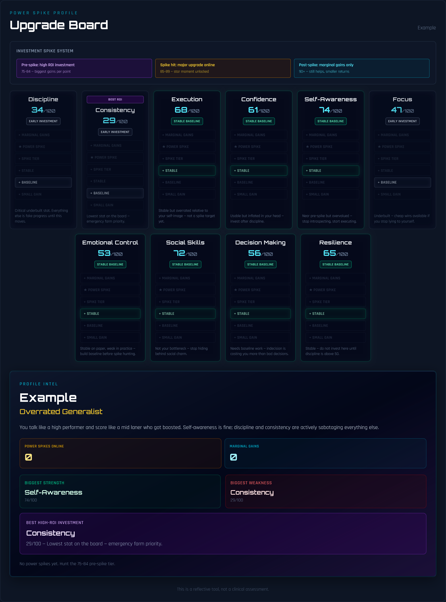

# Power Spike Profile

A Deadlock-inspired self-analysis tool that converts ChatGPT-generated JSON profiles into visual upgrade boards.

## Live Demo

https://power-spike-profile.vercel.app/

Power Spike Profile helps users identify strengths, weak lanes, power spikes, and the highest-ROI stats to invest in next.



## Features

* Deadlock-style upgrade board
* Investment spike progression system
* Power spike stars at major stat breakpoints
* High-ROI stat recommendations
* Multiple profile builds:

  * Analyze Me
  * Brutally Honest
  * Dating & Social
  * Career & Achievement
  * Mental Game
  * Gamer Build
* Guided Game Codex onboarding flow
* Copyable ChatGPT prompts
* JSON validation and parsing
* PNG chart export
* Shareable profile summaries

## How It Works

1. Choose a build preset.
2. Copy the generated ChatGPT prompt.
3. Paste it into ChatGPT.
4. Generate a profile JSON.
5. Paste the JSON into Power Spike Profile.
6. Render your upgrade board.
7. Download the chart or share the summary.

## Investment Spike System

| Score  | Tier                  | Meaning                                        |
| ------ | --------------------- | ---------------------------------------------- |
| 0–24   | Unbuilt               | Weak or undeveloped stat                       |
| 25–49  | Early Investment      | Inconsistent and needs work                    |
| 50–74  | Stable Baseline       | Usable but not a major strength                |
| 75–84  | High ROI / Near Spike | Best zone for noticeable improvement           |
| 85–89  | Power Spike Online    | Major upgrade unlocked                         |
| 90–100 | Marginal Gains        | Additional improvement has diminishing returns |

The star represents the point where a stat reaches its major power spike.

Before the star, investment produces large visible improvements.

After the star, gains continue, but at a slower rate.

## Example Builds

### Analyze Me

General assessment across all life areas.

### Brutally Honest

Prioritizes weaknesses, blind spots, and bottlenecks.

### Dating & Social

Evaluates confidence, attraction, communication, charisma, emotional control, and dating execution.

### Career & Achievement

Evaluates discipline, focus, consistency, leadership, reliability, and execution.

### Mental Game

Evaluates resilience, patience, emotional control, self-awareness, and recovery.

### Gamer Build

Treats the user like an RPG character with stats such as mechanics, strategy, adaptability, learning rate, and leadership.

## Tech Stack

* React
* TypeScript
* Vite
* Tailwind CSS
* html-to-image

## Run Locally

```bash
npm install
npm run dev
```

Development server:

```bash
http://localhost:5173
```

## Build

```bash
npm run build
```

## Project Structure

```text
src/
├── components/
│   ├── BuildSelectCard.tsx
│   ├── HowToModal.tsx
│   ├── InvestmentBar.tsx
│   ├── LandingPage.tsx
│   ├── ProfilePage.tsx
│   ├── StatRow.tsx
│   ├── SummaryPanel.tsx
│   ├── UpgradeBoard.tsx
│   ├── UpgradeColumn.tsx
│   └── ViewToggle.tsx
├── constants/
│   ├── presets.ts
│   └── prompt.ts
├── hooks/
│   └── useProfilePreset.ts
├── types/
│   └── profile.ts
└── utils/
    ├── export.ts
    ├── sampleData.ts
    ├── spikeLogic.ts
    └── validateProfile.ts
```

## Example JSON Format

```json
{
  "profileName": "Alex",
  "archetype": "Volatile Carry",
  "summary": "High execution when locked in, but consistency and patience crater under pressure.",
  "stats": [
    {
      "name": "Execution",
      "score": 87,
      "category": "Performance",
      "comment": "You deliver when stakes are visible; routine tasks get half effort.",
      "tip": "Batch low-stakes work into timed 25-minute blocks.",
      "investmentRead": "Spiked — maintain without overinvesting. Shift ROI to weaker lanes."
    }
  ]
}
```

## Notes

This is a reflective tool, not a clinical assessment.

The app does not diagnose, evaluate mental health, or claim objective psychological accuracy. It is designed to visualize self-reflection, strengths, weaknesses, and growth opportunities through a game-inspired progression system.

## Development Notes

This project was built with:

* React
* TypeScript
* Vite

Vite provides fast development builds, hot module replacement (HMR), and optimized production output.

If extending the project further, consider:

* Type-aware ESLint rules
* Automated testing
* Profile sharing
* Public profile pages
* Historical profile tracking
* Side-by-side profile comparisons

## Roadmap

### v0.3.0

* Shareable profile links
* Public profile pages
* Profile cards
* Social sharing

### v0.4.0

* Profile history
* Progress tracking
* Compare two profiles

### v0.5.0

* AI-generated improvement paths
* Dynamic investment recommendations
* Personalized progression systems
